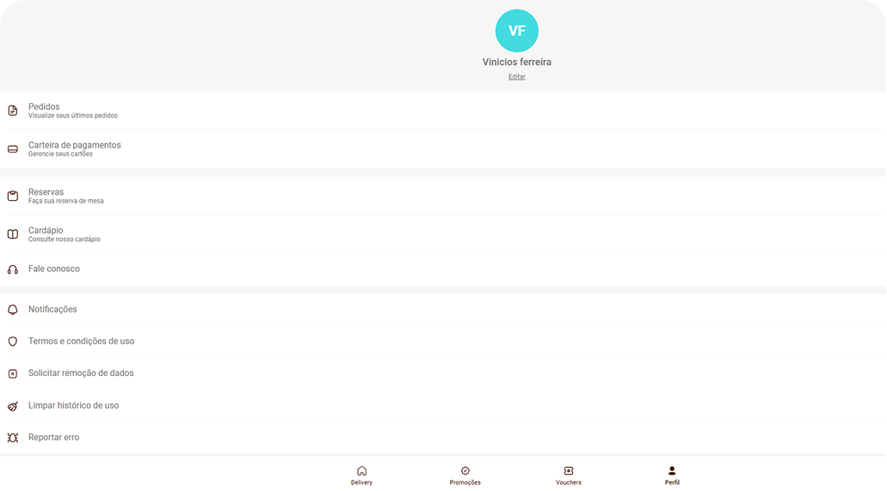

# Identificação de Fluxos Importantes

Bom aqui abaixo estão os 3 fluxos críticos que indenfiquei com problemas na plataforma web do Coco Bambu, que podem impactar negativamente a experiência do usuário e a conversão de vendas.

---

## **1. Problema ao Adicionar um Novo Cartão e Retorno para a Tela de Perfil**

### **Descrição:**
- Na necessidade de adicionar um novo cartão o usuário acessa **Sacola > Pagamento > Trocar > Adicionar novo cartão > Crédito > Adicionar dados de cartão**.
- Após preencher os dados e confirmar, o sistema redireciona o usuário para a **página de carteira de pagamentos** (`/perfil/payment`).
- O botão de "voltar" envia o usuário para a tela de **perfil**, e não de volta ao fluxo da sacola.
- A sacola só pode ser acessada pela aba **“Delivery”**, tornando o fluxo confuso e dificultando a finalização do pedido.
  ### Prints:
  Tela de pagamentos apos adioconar novo cartão

 Tela de login apos a tela de pagamento (não é visivel a sacola)
=======
  

Tela de login apos a tela de pagamento (não é visivel a sacola)

### **Impacto no Usuário:**
- O cliente pode **se perder no fluxo de pagamento** e não conseguir finalizar a compra.
- Pode gerar **abandono do carrinho**, prejudicando as conversões do delivery.

---

## **2. Problema ao Salvar Novo Cartão de Crédito**

### **Descrição:**
- O usuário adiciona um cartão **Mastercard (16 dígitos)** com sucesso.
- Ao tentar adicionar um cartão **American Express (15 dígitos)**, o botão “Salvar” não é habilitado.
- Se o usuário **adicionar um número aleatório no final**, o botão é habilitado, mas ao tentar salvar, aparece a mensagem:
  *“Não foi possível cadastrar seu cartão no momento. Por favor, tente novamente.”*
   ### Print:
   tela de novo cartao nao aceita cartoes com 15 digitos
   

### **Impacto no Usuário:**
- O sistema **não reconhece corretamente cartões com 15 dígitos**, impedindo clientes de usar cartões Amex.
- Usuários podem **se frustrar e abandonar a compra** por não conseguirem adicionar um método de pagamento válido.

---

## **3. Problema ao Realizar Logoff**

### **Descrição:**
- O usuário tenta sair da conta usando o botão **“Sair”** na interface web (testado nos navegadores Edge, Chrome e Firefox).
- O botão **não executa nenhuma ação**, impedindo o usuário de fazer logout.
- O mesmo problema foi reproduzido no smartphone(iphone XR via safari e edge).
### Print:
nao e possivel realizar logout

### **Impacto no Usuário:**
- Falha grave de **segurança**, pois usuários podem ficar logados em dispositivos compartilhados.
- Dificulta a troca de conta, forçando o usuário a usar o mesmo perfil indefinidamente.

---

## **Problemas Extras Encontrados**

### **1. Problema na Interface e Experiência do Usuário**
- **Observações:**
  - Testando pelo desktop, botões aparecem esticados, prejudicando a experiência.
  - A usabilidade se torna confusa devido a elementos desalinhados.
- **Impacto:**
  - Pode comprometer a navegação e gerar desconforto e desconfiança no usuário.

### **2. Problema na Indicação Visual de Seleção de Gorjeta**
- **Observações:**
  - Na sacola, o campo "Gorjeta" apresenta opções em cinza.
  - Isso pode induzir o usuário a pensar que as opções não estão disponíveis.
- **Impacto:**
  - Confusão na escolha da gorjeta.
  - Pode afetar a decisão do cliente e reduzir o valor médio do pedido.

### **3. Código de Verificação Fixo no Cadastro**
- **Observações:**
  - Em todos os testes realizados, o código de verificação enviado por e-mail foi sempre "AAAAAA".
- **Impacto:**
  - Falha grave de segurança, permitindo que qualquer pessoa finalize o cadastro de outro usuário sem precisar acessar o e-mail.
  - Exposição a possíveis fraudes.

---

## **Outros Problemas Identificados**
- **Mensagens de erro pouco informativas:** Erros como o de adicionar cartão não explicam claramente o que ocorreu, dificultando a ação do usuário.
- **Experiência inconsistente entre dispositivos:** Problemas que ocorrem no desktop podem não estar presentes no mobile e vice-versa, o que pode indicar falhas na adaptação responsiva.

---

## **Conclusão**
Os fluxos identificados comprometem a usabilidade, a segurança e a conversão de vendas do delivery do Coco Bambu. Corrigir esses problemas garantirá uma experiência mais intuitiva, segura e eficiente para os usuários.

